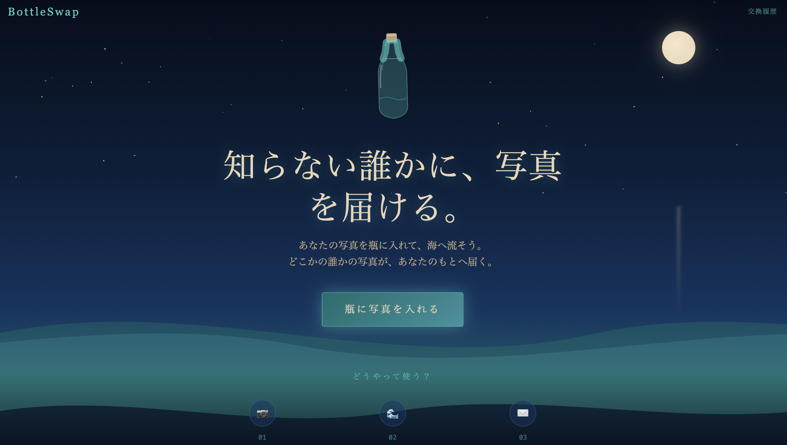
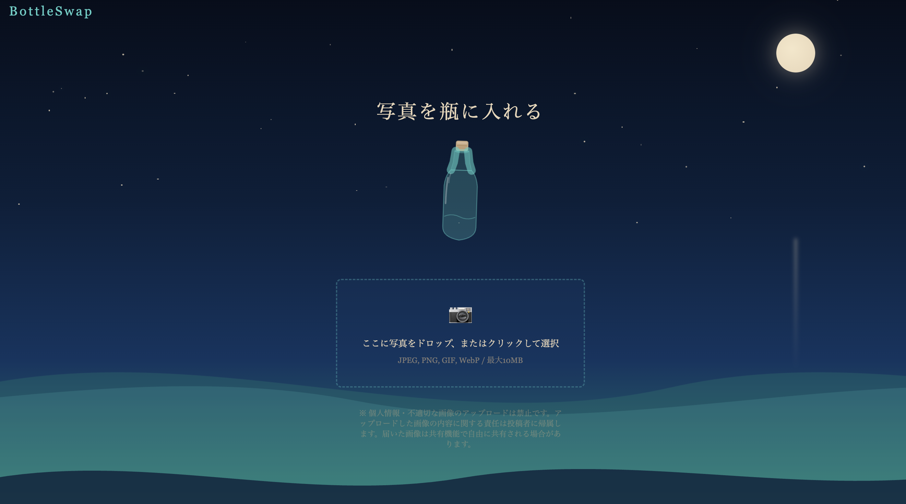

# BottleSwap

匿名で写真を交換するWebアプリです。写真を「瓶」として流すと、別のユーザーが流した写真とマッチングされます。

画像本体はCloudflare R2に保存し、マッチング状態などのメタデータはTurso/libSQLで管理します。

https://swap.mokosau.com/

## 画面

トップ画面では、写真を流す体験がすぐ伝わるように導線を絞っています。



送信画面では、画像選択からアップロードまでを迷わず進められる構成にしています。



## 機能

- 写真のアップロードと匿名マッチング
- Server-Sent Eventsによる待機画面の更新
- R2署名付きURLによる受信画像表示
- localStorageを使った交換履歴
- OGP画像と共有用ページ
- IPハッシュによる簡易rate limit / ban判定

## 技術構成

- Next.js 16 App Router
- React 19 / TypeScript
- Tailwind CSS 4
- Turso / libSQL
- Cloudflare R2
- sharp
- next-intl

## 実装

- `/api/upload` で画像形式とサイズを検証し、`sharp` でEXIF除去、リサイズ、JPEG再エンコードを行います。
- 画像はR2のprivate bucketに保存し、DBにはobject keyのみを保存します。
- `/api/stream` はSSEでマッチング状態を待ち、成立時に相手画像の署名付きURLを返します。
- `turso/schema.sql` にTurso/libSQL用のschemaを置いています。

## ローカル起動

```bash
npm ci
cp .env.example .env.local
npm run dev
```

必要な環境変数は `.env.example` を参照してください。Tursoの初期schemaは以下で適用します。

```bash
turso db shell <database-name> < turso/schema.sql
```
